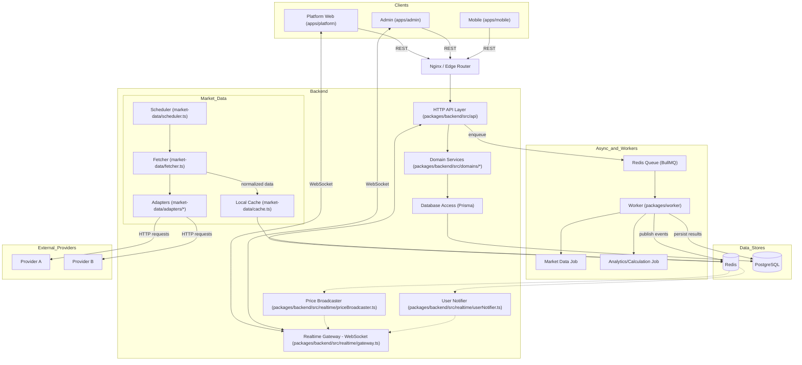
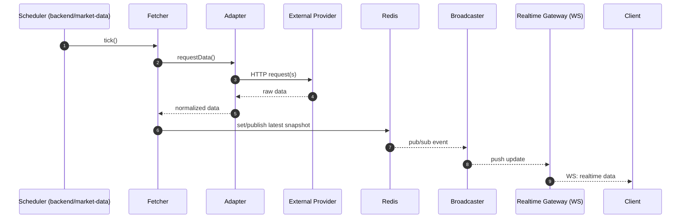
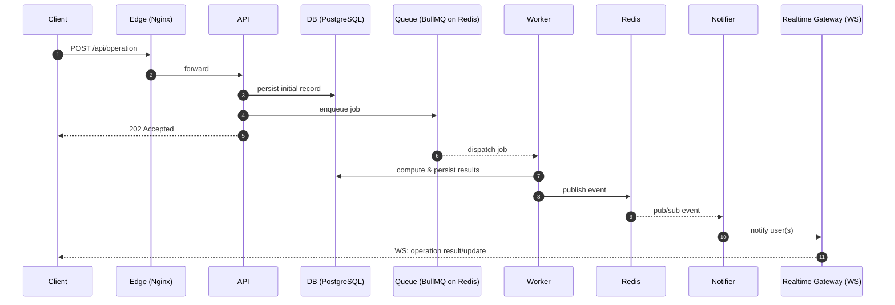
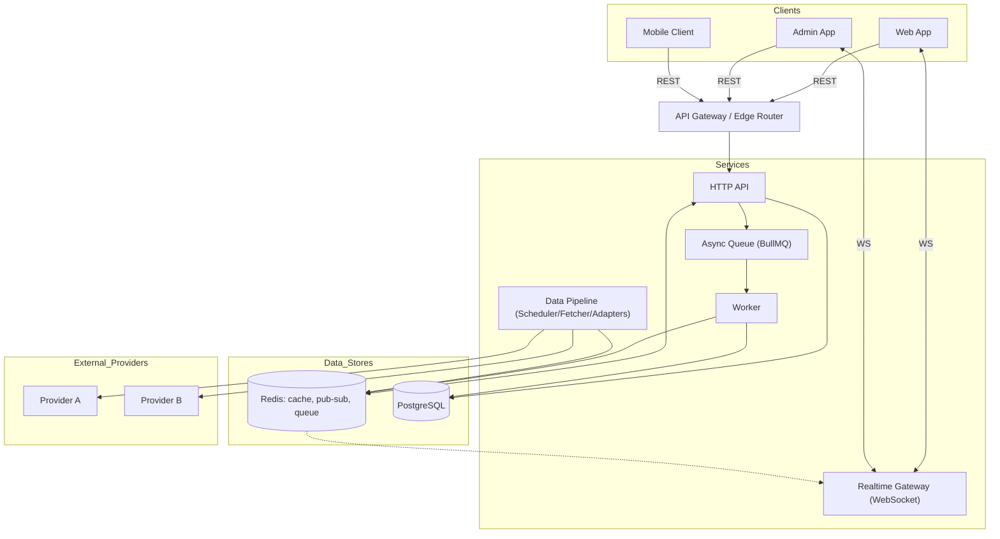

# System Architecture (Repo-Aligned, Domain-Abstracted)

This diagram reflects the actual packages and apps in this monorepo, keeping business logic abstract while showing your technical design: multi-client frontends, HTTP API, realtime gateway, market data ingestion, Redis cache + BullMQ, PostgreSQL, and a background worker.

## Runtime Flows

### A) Realtime Market Data Pipeline

### B) User Operation with Async Processing and Realtime Notify

## Optional, Resume-Safe Abstracted View
Use this version publicly if you want to fully hide domain modules (orders/trades/etc.) while keeping your technical strengths clear.

