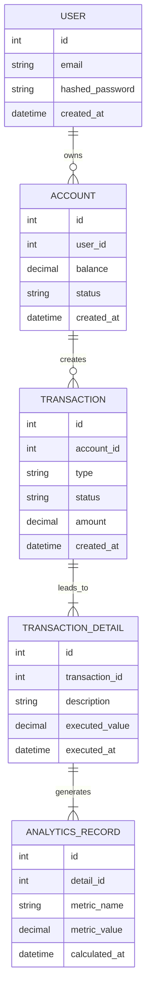

## High-Level Overview (Abstracted)


```mermaid
graph TD
    %% 1. Define Nodes & Relationships
    A1[Third-Party Data API 1] --> B1
    A2[Third-Party Data API 2] --> B1
    A3[Third-Party Data API 3] --> B1

    B1[Data Ingestion Service] --> B2[Data Processor]  --> B3[Real-time Cache (Redis)]
    B3 --> B4[WebSocket Service]

    B4 -->|WebSocket| D1[Main Web App (React)]
    B4 -->|WebSocket| D2[Admin Dashboard (React)]

    D1 -->|REST / WS| C1[API Gateway (Fastify/Express)]
    D2 -->|REST / WS| C1

    C1 --> C2[Core Service 1] --> C4[Core Service 3] --> C5[SQL Database (PostgreSQL)]
    C1 --> C3[Core Service 2] --> C5
    C1 -->|Push real-time data| B4

    C6[Async Job Worker (BullMQ)] -->|Async DB updates| C5
    C6 -->|Push job results to cache| B3

    %% 2. Group into Subgraphs
    subgraph External Data Sources
        A1
        A2
        A3
    end

    subgraph Data Pipeline
        B1
        B2
        B3
        B4
    end

    subgraph Core Backend API
        C1
        C2
        C3
        C4
        C5
        C6
    end

    subgraph Client Frontends
        D1
        D2
    end
```

-----

## 🗄️ Data Persistence Model (Abstracted)

This ERD shows you know how to model data with relationships, but it generalizes "Orders" and "Trades" into "Transactions," and "PNL" into "Analytics." This is a common pattern in many applications (like e-commerce, logging, etc.) and is much less revealing.

**Pro-tip:** For showing off *dev skills*, the architecture diagram above is often more powerful than a database schema. You might consider only showing that first diagram.

